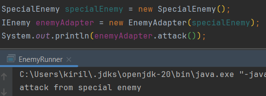

Паттерн "Адаптер" (Adapter) используется для того, чтобы "адаптировать" интерфейс одного класса к интерфейсу, ожидаемому
клиентом. Это позволяет объектам с несовместимыми интерфейсами работать вместе. Адаптер оборачивает один из объектов и
переводит вызовы от клиента в формат, который этот объект может понять.

Самым простым примером паттерна Адаптер в джаве является метод asList() класса Arrays.
Он принимает на вход массив чисел, а возвращает лист, состоящий из этих же чисел.

Результат работы программы:

