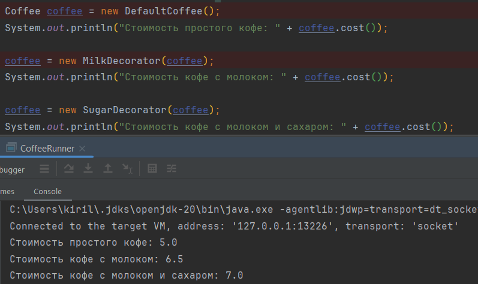

Паттерн **Декоратор**
Decorator решает проблему динамического добавления новых функциональных возможностей объектам без изменения их
структуры. Это особенно полезно в ситуациях, когда необходима гибкость в расширении поведения объектов.

Результат работы программы:

